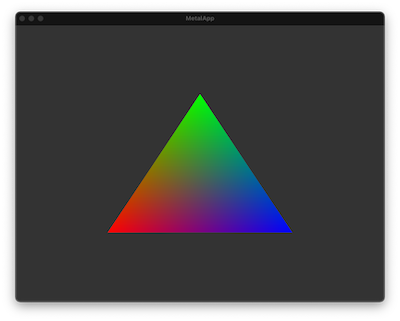

	

# Metal App

A minimal Metal demo application for macOS, iOS, tvOS and SPM.
This app demonstrates how to use a display link to sychronize with the monitor refresh rate and how to setup a Metal based view without any higher level frameworks.
It also does not use any Storyboards or Xibs.

Either `open MetalApp.xcodeproj` and run one of the `MatalApp_*` targets or execute `swift run` to start the SPM based Metal app.

## Resources

- [Metal Programming Guide](https://developer.apple.com/library/archive/documentation/Miscellaneous/Conceptual/MetalProgrammingGuide/)
- [Metal Best Practices](https://developer.apple.com/library/archive/documentation/3DDrawing/Conceptual/MTLBestPracticesGuide/)
- [Metal Documentation](https://developer.apple.com/documentation/metal/)
- [Metal Shading Language Specification](https://developer.apple.com/metal/Metal-Shading-Language-Specification.pdf)

<!--

-->